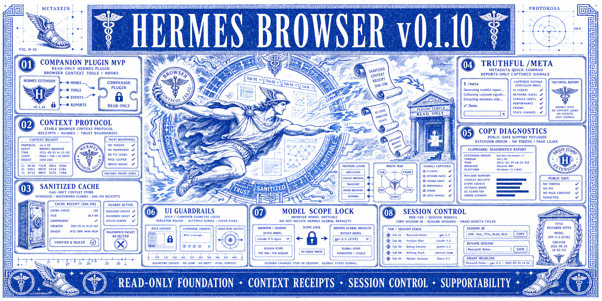

# Hermes Browser Extension v0.1.10 Release Notes

Release date: 2026-07-07

Hermes Browser Extension v0.1.10 is the supportability and integration bridge release: read-only Browser context stays the foundation, while Browser Context Protocol receipts, an optional companion plugin, truthful diagnostics, session control, and Browser-scoped model selection make the extension easier to operate and support.

## Launch ad

Use the v0.1.10 launch ad asset:



## What ships in v0.1.10

### 1. Companion Plugin MVP

The optional `companion-plugin/` is now a functional, fail-soft Hermes plugin rather than a placeholder skeleton. It registers:

- `browser_context_status` — check whether Browser context is cached.
- `browser_get_context` — retrieve the sanitized current Browser context envelope.
- `browser_clear_context` — clear the process-local cache.
- `browser_event_log` — inspect bounded diagnostic events.
- `pre_llm_call` and `post_tool_call` hooks.
- A bundled `hermes-browser` skill.

The plugin remains supplemental. The extension still works through prompt-embedded Browser Context Protocol fallback when the plugin is absent. The plugin does **not** add browser control, API-server routes, network calls, `nativeMessaging`, `debugger`, or page-action channels.

### 2. Browser Context Protocol receipts + sanitized cache

v0.1.10 keeps Browser Context Protocol as the trust boundary for read-only context. The companion cache parses `UNTRUSTED_BROWSER_CONTEXT_START` / `UNTRUSTED_BROWSER_CONTEXT_END` blocks and stores safe metadata only:

- protocol id and payload hash;
- context scope;
- active-tab origin rather than full private URL;
- section availability/counts for page text, selected text, metadata, transcript, and tabs;
- redaction count and truncation state;
- bounded event diagnostics with secret-looking values redacted.

It deliberately avoids storing raw page text, selected text, full tab URLs, cookies, bearer tokens, API keys, prompt payloads, or browser-control state.

### 3. Truthful `/meta` quick command

`/meta` now ships with `/metadata` and `/head` aliases. It analyzes captured Browser context for page metadata and SEO/content signals, but it is intentionally truthful: it reports only what the extension actually captured and explicitly lists metadata classes that are unavailable from the current context.

This prevents the command from implying that the extension captured raw `<head>` HTML, Open Graph, Twitter Cards, JSON-LD, canonical, hreflang, robots, or favicon values unless those values are present in the supplied Browser context.

### 4. Copy Diagnostics and supportability hardening

Copy Diagnostics now better supports public support triage with redacted extension origin, browser family, build/version, gateway origin, connection state, capability flags, selected model/provider, context mode, extractor mode, and last visible error. It intentionally excludes API keys, bearer tokens, cookies, page text, selected text, full tab URLs, tab titles, and webpage content.

The Browser continues to distinguish a reachable gateway from upstream Hermes runtime/tool failures, so runtime tracebacks show as connected-with-warning diagnostics instead of making the entire extension look disconnected.

### 5. Session control

v0.1.10 adds compact Browser session controls for day-to-day work:

- create/switch Browser sessions from the side panel;
- copy the current session ID for debugging and handoff;
- rename sessions through `PATCH /api/sessions/{id}`;
- keep session action buttons compact/on-brand;
- group/label Browser sessions by source;
- generate smarter first-message titles instead of leaving default `Hermes Browser Extension` labels everywhere.

### 6. Model Scope Lock

Browser model selection is now scoped to the extension rather than Hermes global defaults. v0.1.10 adds:

- Browser-scoped preferred model storage;
- per-session model/provider bindings;
- new Browser sessions inheriting the last Browser-selected model;
- existing sessions keeping their own model binding;
- safeguards so switching Browser models does not mutate Hermes Desktop/global defaults.

### 7. UI guardrails and polish

The release includes UI supportability polish across the side panel:

- loading skeletons;
- context-meter warn/critical glow states;
- tool activity fade-in;
- command-menu stagger;
- settings readability/text-size controls;
- dock/model-picker layout guards;
- Hermes scrollbar consistency in bottom-dock areas;
- compact session menu actions.

Reduced-motion users keep the relevant animation guardrails.

### 8. Public docs and packaging

Public docs are updated for v0.1.10:

- `README.md`;
- `CHANGELOG.md`;
- `SECURITY.md`;
- `PRIVACY.md`;
- `PERMISSIONS.md`;
- `DATA-FLOW.md`;
- `companion-plugin/install.md`.

Version surfaces prepared for v0.1.10:

- `package.json`;
- `package-lock.json`;
- root `manifest.json`;
- `extension/manifest.json`;
- `companion-plugin/plugin.yaml`;
- generated `build-info.json` / `extension/build-info.json` / `dist/build-info.json` after build;
- generated `dist/manifest.json` and release archive after packaging.

## PR and contributor citations

### Incorporated into v0.1.10

- **PR #31** — [feat(companion-plugin): activate context cache from skeleton to functional plugin](https://github.com/abundantbeing/hermes-browser-extension/pull/31) by **@iruzen-dono**. Credited for the functional companion plugin, context cache, tools, hooks, policy, install docs, bundled skill, and companion tests.
- **PR #32** — [feat(commands): /meta command + CSS polish (skeletons, animations)](https://github.com/abundantbeing/hermes-browser-extension/pull/32) by **@iruzen-dono**. Credited for the `/meta` command direction and UI polish work. The final release implementation keeps `/meta` truthful to captured Browser context.
- **@abundantbeing** — release integration, v0.1.10 version/docs/packaging, supportability fixes, Browser-scoped model/session controls, final copy/diagnostics pass, and launch ad asset.

### Reviewed but deferred from v0.1.10

- **PR #29** — [feat: add scoped element picker context](https://github.com/abundantbeing/hermes-browser-extension/pull/29) by **@bradlishman**. Deferred; not part of the v0.1.10 shipped surface.
- **PR #30** — [feat: add native sidebar support for Opera browser](https://github.com/abundantbeing/hermes-browser-extension/pull/30) by **@barteqpl**. Deferred; not part of the v0.1.10 shipped surface.
- **PR #33** — [Security: fix parameter evasion, CWD binary hijacking, and clipboard handling](https://github.com/abundantbeing/hermes-browser-extension/pull/33) by **@Doom-pixel-alt**. Deferred; not part of the v0.1.10 shipped surface.

## Release verification

Release-prep verification run on 2026-07-07:

```bash
npm run package
npm run verify
npm run lint
python -m py_compile companion-plugin/*.py
```

Results:

- `npm run package` rebuilt `dist/`, stamped build metadata, and produced `artifacts/hermes-browser-extension.tar.gz`.
- `npm run verify` passed: 203/203 tests, JS syntax checks, and `scripts/check-manifest.mjs`.
- Manifest check reported `Manifest OK: Hermes Browser Extension 0.1.10`.
- `npm run lint` completed with 0 errors and 8 pre-existing warnings in `extension/sidepanel.js`.
- `python -m py_compile companion-plugin/*.py` completed successfully.
